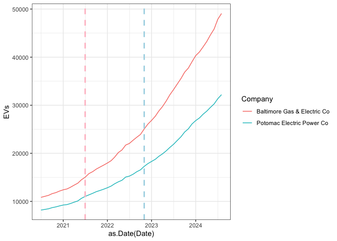

# What is the impact of EV TOU Rebate on EV Sales in Maryland


# Introduction

With almost a third of CO2 emissions in Maryland generated by cars
reducing these emissions is crucial for the state’s climate goals
(“Department of the Environment”). A significant barrier to widespread
electric vehicle (EV) adoption, however, is the cost. Time-of-Use (TOU)
rebates, which incentivize EV owners to charge during off-peak hours,
offer a strategic approach to lowering the operational costs of EV
ownership. Maryland has implemented TOU rebates to encourage residents
to charge their vehicles when electricity is cheaper, easing grid strain
and making EVs more affordable. This research investigates the impact of
Maryland’s TOU rebates on EV adoption, aiming to assess the program’s
effectiveness. By understanding this relationship, Maryland policymakers
can enhance rebate programs and serve as a model for other states. This
approach supports the accelerated transition to EVs, reduction in
emissions, and advancement of clean energy goals nationwide.

# Literature Review

Many states, like Maryland, strive to reduce emissions from the
transportation sector. To accelerate EV adoption, one policy approach is
the implementation of Time-of-Use (TOU) rebates. Significant research,
such as Bailey et al. (2024), discusses the implications of
electricity rate designs—particularly TOU rates—on EV adoption. Bailey et al. (2024)
find that TOU rates can incentivize EV owners to charge during
off-peak hours, making EVs more affordable. However, the study
highlights some issues; for instance, higher-income households are more
likely to own EVs and thus benefit more from the pricing incentive.

While the NBER study provides insights into how TOU pricing works in
general, it does not focus on specific states, such as Maryland. Our
research addresses this gap by examining how Maryland’s TOU rebate
program impacts EV sales within the state. By focusing on Maryland, we
can better assess whether the rebate program is effectively helping
residents adopt EVs. Additionally, unlike Bailey et al. (2024), our research
will consider factors such as gas prices, which may further influence EV
adoption. Thus, our study aims to provide a more localized analysis of
Maryland’s TOU rebates and their effect on EV sales.

This code installs all the necessary packages:

``` r
#install.packages("tidyverse")
#install.packages("kableExtra")
```

These are the packages we will be using:

``` r
library("tidyverse")
library("kableExtra")
```

This code is opening the csv file and storing the contents in a
dataframe df.

``` r
df<-read.csv("panel.csv")
```

The table below shows the first ten observations of our data frame.

``` r
kable(head(df))
```

| Date       | Company                     |   EVs | EVTOURebate |
|:-----------|:----------------------------|------:|------------:|
| 2020-07-01 | Baltimore Gas & Electric Co | 10841 |           0 |
| 2020-07-01 | Potomac Electric Power Co   |  8192 |           0 |
| 2020-08-01 | Baltimore Gas & Electric Co | 11050 |           0 |
| 2020-08-01 | Potomac Electric Power Co   |  8329 |           0 |
| 2020-09-01 | Baltimore Gas & Electric Co | 11257 |           0 |
| 2020-09-01 | Potomac Electric Power Co   |  8464 |           0 |

# Data Description

The frequency of the data frame is monthly and the cross-sectional
(geographical) unit is electric company. 

The treated group consists of electric vehicle (EV) sales associated with the Baltimore Gas & Electric Co. (BGE) during the Time-of-Use (TOU) rebate period starting July 2021. These sales are impacted by the implementation of the TOU rebate. The untreated group includes EV sales under both the Baltimore Gas & Electric Co. (BGE) and Potomac Electric Power Co. (Pepco) before the TOU rebate period, and those for Pepco throughout the study, as they were not subject to the TOU rebate during the treatment window.

The dataset used in this study includes monthly records from two major electric companies in Maryland—Baltimore Gas & Electric Co (BGE) and Potomac Electric Power Co (Pepco). BGE is subject to a Time-of-Use (TOU) pricing structure, which incentivizes electric vehicle (EV) owners to charge during off-peak hours when electricity is cheaper. This TOU pricing mechanism effectively lowers operational costs for EVs and helps manage grid demand. In contrast, Pepco does not offer a TOU pricing plan, allowing for a comparison between regions with and without such incentives. By differentiating between these pricing models, the study can assess the impact of TOU rebates on EV adoption across different electric facilities in Maryland.

The below code shows the two electric companies that we will focusing
on:

``` r
table(df$Company)
```


    Baltimore Gas & Electric Co   Potomac Electric Power Co 
                             50                          50 

The below code displays all the variables (column) in the dataframe:

``` r
names(df) 
```

    [1] "Date"        "Company"     "EVs"         "EVTOURebate"

The treatment variable of interest is TOU Time x BGE and the outcome
variable of interest is EVs.

# Map

Here we are focusing on Pepco and BGE:


Below is a boxplot that visualizes the distribution of the outcome
variable under treatment and no treatment.

``` r
ggplot(df, aes(x=as.Date(Date), y=EVs, col=Company)) + geom_line() +
  geom_vline(xintercept=as.Date(as.Date("2021-07-01")), col="pink", linetype="dashed", lwd=1) +
  geom_vline(xintercept=as.Date(as.Date("2022-11-01")), col="lightblue", linetype="dashed", lwd=1) +
  theme_bw()
```



The regression model $y=\beta_0 + \beta_1 x + \epsilon$ where $y$ is the
outcome variable and $x$ is the treatment variable.

Below are our results:

``` r
df2<-df %>%
  mutate(BGE = ifelse(Company == "Baltimore Gas & Electric Co", 1, 0)) %>%
  mutate(TOU_time=ifelse(as.Date(Date)>as.Date("2021-07-01"),1,0))

model1<-lm(EVs ~ TOU_time * BGE + as.factor(Date), data=df2)

summary(model1)
```


    Call:
    lm(formula = EVs ~ TOU_time * BGE + as.factor(Date), data = df2)

    Residuals:
       Min     1Q Median     3Q    Max 
     -3658  -1209      0   1209   3658 

    Coefficients: (1 not defined because of singularities)
                              Estimate Std. Error t value Pr(>|t|)    
    (Intercept)                 7900.0     1721.6   4.589 3.22e-05 ***
    TOU_time                   27954.3     2406.4  11.617 1.50e-15 ***
    BGE                         3233.1      920.3   3.513 0.000976 ***
    as.factor(Date)2020-08-01    173.0     2346.2   0.074 0.941527    
    as.factor(Date)2020-09-01    344.0     2346.2   0.147 0.884046    
    as.factor(Date)2020-10-01    637.5     2346.2   0.272 0.787005    
    as.factor(Date)2020-11-01    826.0     2346.2   0.352 0.726335    
    as.factor(Date)2020-12-01   1087.5     2346.2   0.464 0.645089    
    as.factor(Date)2021-01-01   1313.0     2346.2   0.560 0.578335    
    as.factor(Date)2021-02-01   1446.5     2346.2   0.617 0.540458    
    as.factor(Date)2021-03-01   1727.5     2346.2   0.736 0.465133    
    as.factor(Date)2021-04-01   2091.5     2346.2   0.891 0.377139    
    as.factor(Date)2021-05-01   2423.0     2346.2   1.033 0.306903    
    as.factor(Date)2021-06-01   3064.5     2346.2   1.306 0.197724    
    as.factor(Date)2021-07-01   3513.5     2346.2   1.498 0.140803    
    as.factor(Date)2021-08-01 -27069.5     2346.2 -11.538 1.91e-15 ***
    as.factor(Date)2021-09-01 -26705.5     2346.2 -11.382 3.09e-15 ***
    as.factor(Date)2021-10-01 -26266.0     2346.2 -11.195 5.53e-15 ***
    as.factor(Date)2021-11-01 -25927.0     2346.2 -11.051 8.70e-15 ***
    as.factor(Date)2021-12-01 -25594.0     2346.2 -10.909 1.36e-14 ***
    as.factor(Date)2022-01-01 -25224.0     2346.2 -10.751 2.24e-14 ***
    as.factor(Date)2022-02-01 -24804.0     2346.2 -10.572 3.97e-14 ***
    as.factor(Date)2022-03-01 -24217.0     2346.2 -10.322 8.89e-14 ***
    as.factor(Date)2022-04-01 -23527.5     2346.2 -10.028 2.31e-13 ***
    as.factor(Date)2022-05-01 -23096.5     2346.2  -9.844 4.22e-13 ***
    as.factor(Date)2022-06-01 -22246.0     2346.2  -9.482 1.40e-12 ***
    as.factor(Date)2022-07-01 -21988.0     2346.2  -9.372 2.03e-12 ***
    as.factor(Date)2022-08-01 -21453.5     2346.2  -9.144 4.36e-12 ***
    as.factor(Date)2022-09-01 -20875.0     2346.2  -8.897 1.00e-11 ***
    as.factor(Date)2022-10-01 -20396.5     2346.2  -8.693 2.01e-11 ***
    as.factor(Date)2022-11-01 -19466.0     2346.2  -8.297 7.87e-11 ***
    as.factor(Date)2022-12-01 -18681.5     2346.2  -7.962 2.51e-10 ***
    as.factor(Date)2023-01-01 -18056.0     2346.2  -7.696 6.36e-10 ***
    as.factor(Date)2023-02-01 -17397.0     2346.2  -7.415 1.70e-09 ***
    as.factor(Date)2023-03-01 -16575.0     2346.2  -7.065 5.85e-09 ***
    as.factor(Date)2023-04-01 -15837.0     2346.2  -6.750 1.78e-08 ***
    as.factor(Date)2023-05-01 -14970.0     2346.2  -6.381 6.56e-08 ***
    as.factor(Date)2023-06-01 -13939.0     2346.2  -5.941 3.08e-07 ***
    as.factor(Date)2023-07-01 -13089.0     2346.2  -5.579 1.10e-06 ***
    as.factor(Date)2023-08-01 -12106.0     2346.2  -5.160 4.67e-06 ***
    as.factor(Date)2023-09-01 -11137.5     2346.2  -4.747 1.90e-05 ***
    as.factor(Date)2023-10-01  -9995.0     2346.2  -4.260 9.48e-05 ***
    as.factor(Date)2023-11-01  -9227.0     2346.2  -3.933 0.000270 ***
    as.factor(Date)2023-12-01  -8066.5     2346.2  -3.438 0.001220 ** 
    as.factor(Date)2024-01-01  -7070.5     2346.2  -3.014 0.004114 ** 
    as.factor(Date)2024-02-01  -6411.0     2346.2  -2.733 0.008771 ** 
    as.factor(Date)2024-03-01  -5526.0     2346.2  -2.355 0.022643 *  
    as.factor(Date)2024-04-01  -4630.0     2346.2  -1.973 0.054221 .  
    as.factor(Date)2024-05-01  -3561.5     2346.2  -1.518 0.135577    
    as.factor(Date)2024-06-01  -2574.0     2346.2  -1.097 0.278073    
    as.factor(Date)2024-07-01  -1030.0     2346.2  -0.439 0.662625    
    as.factor(Date)2024-08-01       NA         NA      NA       NA    
    TOU_time:BGE                6332.4     1069.8   5.919 3.33e-07 ***
    ---
    Signif. codes:  0 '***' 0.001 '**' 0.01 '*' 0.05 '.' 0.1 ' ' 1

    Residual standard error: 2346 on 48 degrees of freedom
    Multiple R-squared:  0.9752,    Adjusted R-squared:  0.9488 
    F-statistic: 36.95 on 51 and 48 DF,  p-value: < 2.2e-16

The equation that describes the linear regression is
$ev_{ct} = \beta_0 + \beta_1 TOUTime_{t} + \beta_2 BGE_{c} + \beta3TOU_{c}*BGE_{t} + \alpha_{Date} + \epsilon_{ct}$

Let’t say we want to calculate the predicted value of the outcome
variable when treatment = 1. Using the equation:

EV Sales = intercept (7900) + TOU_time (27954)+ BGE (3233) + TOU_time
(6332) = 45,419

# Discussion of Our Results

Our research on Maryland’s Time-of-Use (TOU) rebate program reveals that
TOU rebates significantly contributed to the growth of electric vehicle
(EV) sales in the state. From mid-2021 to late 2023, TOU rebates were
directly responsible for the sale of approximately 6,000 EVs,
representing nearly 14% of the 45,000 EVs sold during this period.

 A comparative analysis using box plots demonstrated a notable
difference in EV sales with and without TOU rebates: sales doubled from
5,000 to 10,000 when TOU rebates were applied. 

This clear contrast underscores the effectiveness of TOU rebates in
increasing EV adoption by reducing operational costs. Maryland
policymakers can leverage these insights to enhance rebate programs,
potentially setting a precedent for similar initiatives in other regions
to drive EV adoption and support emission reduction goals.

# Future Plans

1.  **Analyze the Impact of Gas Price Differences on EV Sales:**
    Investigate how fluctuations in gas prices between different fuel
    companies influence EV sales, potentially highlighting how rising
    gas prices may further encourage EV adoption among consumers.
2.  **Compare Used Car Prices in Different Regions:** Examine the
    variation in used car prices between the Potomac and Baltimore areas
    to understand regional price disparities and how these might affect
    consumer decisions between purchasing EVs versus traditional
    vehicles.
3.  **Assess Pre-July 2021 EV Dealership Sales Trends:** Conduct a
    historical analysis of EV sales trends at dealerships before July
    2021 to identify patterns or shifts in consumer interest and
    evaluate if early adoption behaviors differ from recent trends
    influenced by TOU rebates.

# Causal Graph


Here, our project mainly considered the impact (and therefore government
incentives) on EV Sales. However, there were some other factors that
impact EV Sales that we can incorporate into future studies as well.
Situations involving gas prices and EV dealership availability across
counties heavily impact consumer behavior, which ultimately is another
very important factor when considering EV sales. Furthermore, we haven’t
completely explored the other effects of government incentives in
relation to EV sales. Government policies on dealership availability
(during the COVID period) and charging infrastructure availability also
impact EV sales. In the future, looking deeper into these elements and
how they impact each other can help us better understand EV sales.

# Bibliography

Bailey, M. R., Brown, D. P., Myers, E., Shaffer, B. C., & Wolak, F. A. (2024).
Electric vehicles and the energy transition: Unintended consequences of a common retail rate design (Working Paper No. 32886). 
National Bureau of Economic Research. https://www.nber.org/papers/w32886

Maryland Clean Cars Program. (n.d.). *Department of the Environment*.
Retrieved November 4, 2024, from
http://mde.maryland.gov/programs/Air/MobileSources/Pages/CleanCars.aspx

Hughes, W. K., Williams, H. D., Mills, J. M., Richard, M. T., O’Donnell,
A. J., Maryland Public Service Commission, & Commission’s Energy
Analysis and Planning Division. (2016). Ten-Year Plan (2016 – 2025) of
electric companies in Maryland. In Maryland Department of Natural
Resources & Maryland Public Service Commission, *Maryland Department of
Natural Resources*.
https://www.psc.state.md.us/wp-content/uploads/Final-2016_2025_TYP-12_8_16.pdf
